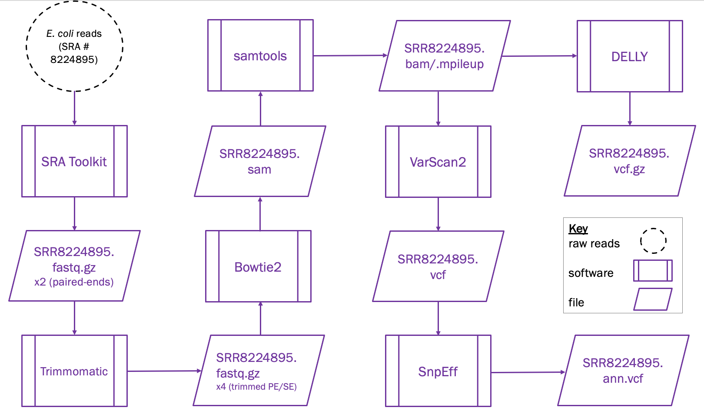
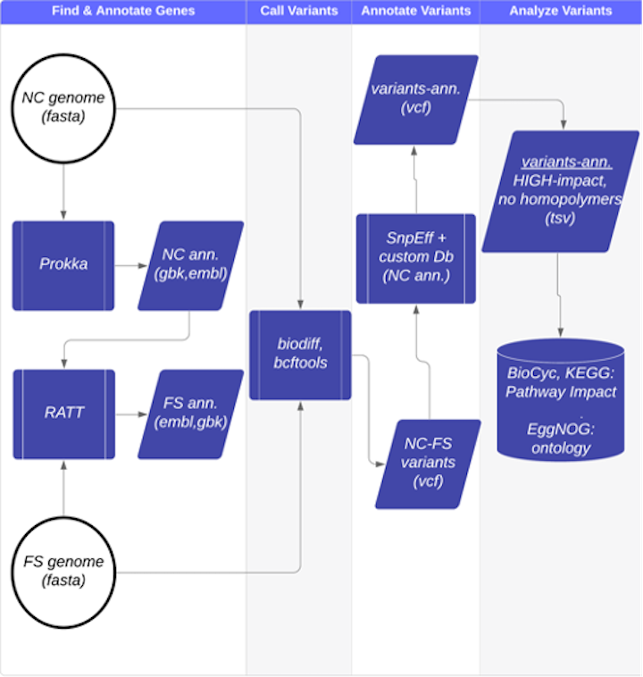

# Genomics Pipelines
Two genomics pipelines were created that both culminated in the calling of variants (e.g. SNPs, indels, genomic rearrangements). The pipeline's shell scripts were run on the [Pittsburgh BRIDGES supercomputer](https://portal.xsede.org/psc-bridges) (part of the XSEDE virtual system). Using a supecomputer had two major benefits:
- i) because many bioinformatics algorithms are time-consuming to run, programs were run in parallel across a maximum of 16 cores to expedite run time
- ii) because many of the intermediate files are large (e.g. mpileup files are ~ 0.5 MB), the 1 terabyte of storage space made file size a non-issue

With the aid of project-specific virtual environments, the following genomics pipelines were creatd:

## Pipeline #1 (*E. coli*): Genome Assembly to Variant-Calling

**Purpose:** An exploratory analysis to identify the different types of genomic variants present in an [*E. coli* genome](https://www.ncbi.nlm.nih.gov/sra/?term=SRR8224895).

**Pipeline #1 Workflow**

Software | Usage
SRA Toolkit | creates two FASTQ files of paired-end reads
FastQC | assesses raw reads for sequencing errors
Trimmomatic | trims reads to create four files of paired/unpaired and FWD/REV reads
FastQC | assesses trimmed reads for per base quality, adapter content, etc.
Bowtie2 | aligns reads to a reference genome (E. coli strain K12)
samtools | left-aligns and indexes reads, then calls bases
VarScan2 | calls variants for SNPs and indels only
bcftools | left-aligns indels to improve annotation accuracy
SnpEff | annotates variants from VarScan2
DELLY | calls variants for genomic rearrangements (e.g. structural variants)

## Pipeline #2 (*S. aureus*): Genome Annotation to Variant-Calling

**Purpose:** An exploratory analysis to identify genomic variants only in a drug treated *S. aureus* strain (FS), and not in an untreated, control strain (NC). Both [FS and NC strains](https://www.ncbi.nlm.nih.gov/bioproject/?term=PRJNA480363) are methicillin-resistant and therefore qualify as MRSA.

**Pipeline #2 Workflow**

Software | Usage
Prokka | finds genes with prodigal and annotates gene function *de novo* (NC only)
RATT | finds and annotates gene function from a reference genome (NC to FS)
biodiff | calls FS variants relative to NC genome
bcftools | identifies variant types (e.g. SNPs, indels) and plots variant statistics
SnpEff | annotates FS variants relative to NC genome